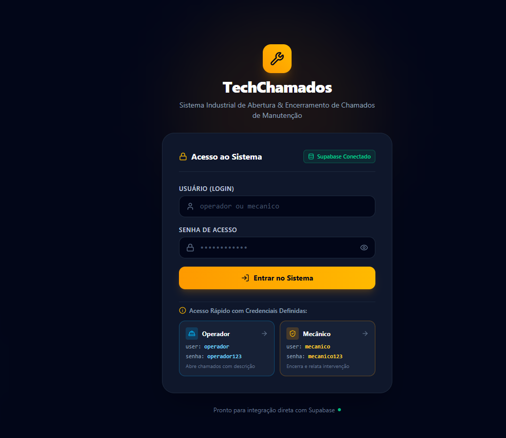
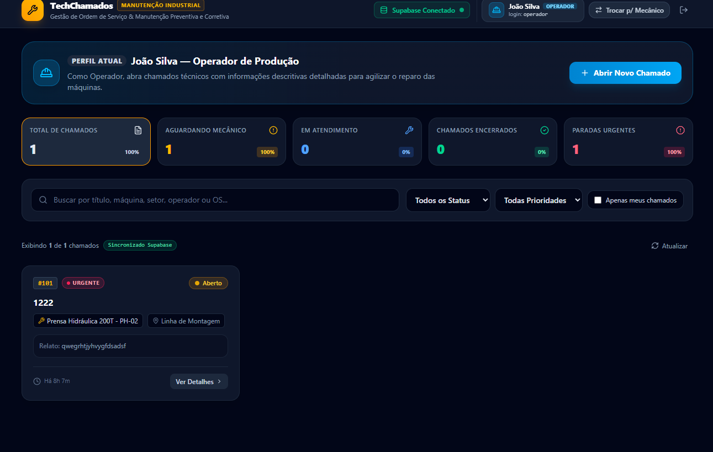

# 🎫 Sistema de Chamados

Sistema web desenvolvido para gerenciamento de chamados, permitindo organizar solicitações, acompanhar atendimentos e controlar o status das demandas.

O projeto foi desenvolvido com apoio de **Inteligência Artificial generativa**, utilizando o **Google AI Studio / Gemini** e criação de prompts como parte do processo de desenvolvimento.

🔗 **Demo:** https://sistema-de-chamados-k636.vercel.app/

---

## ✨ Funcionalidades

- 🔐 Sistema de login e autenticação
- 🎫 Criação e gerenciamento de chamados
- 📋 Organização e acompanhamento das solicitações
- 🔄 Controle do status dos chamados
- 👤 Gerenciamento das informações dos chamados
- 💾 Persistência dos dados utilizando Supabase
- ⚡ Integração entre frontend, backend e banco de dados
- 🌐 Aplicação publicada na Vercel
- 🤖 Desenvolvimento com apoio de Inteligência Artificial

---

## 🖥️ Preview

### 🔐 Tela de Login



### 🎫 Sistema de Chamados



---

## 🛠️ Tecnologias utilizadas

- **React** — construção da interface
- **TypeScript** — tipagem e organização do código
- **Vite** — desenvolvimento e configuração do projeto
- **Supabase** — backend, banco de dados e autenticação
- **Vercel** — deploy e hospedagem
- **Google AI Studio / Gemini** — apoio durante o desenvolvimento

---

## 📌 O que pratiquei

Durante o desenvolvimento deste projeto, pratiquei:

- Criação de prompts para orientar uma IA na construção de uma aplicação
- Desenvolvimento de uma aplicação web utilizando Inteligência Artificial como apoio
- Leitura e entendimento do código gerado pela IA
- Desenvolvimento de interfaces utilizando React e TypeScript
- Criação de uma tela de login e integração com autenticação
- Integração da aplicação com banco de dados
- Organização e gerenciamento de dados utilizando Supabase
- Configuração de variáveis de ambiente
- Testes e validação da aplicação
- Identificação e correção de ajustes necessários no sistema
- Deploy de uma aplicação web utilizando Vercel

---

## 🚀 Como executar o projeto

### Pré-requisitos

Para executar o projeto localmente, é necessário ter:

- [Bun](https://bun.sh/) instalado
- Uma conta no [Supabase](https://supabase.com/)
- Um projeto criado no Supabase

### 1. Clone o repositório

```bash
git clone https://github.com/yasminalba/Sistema-de-chamados.git
cd Sistema-de-chamados
```

### 2. Instale as dependências

```bash
bun install
```

### 3. Configure as variáveis de ambiente

Copie o arquivo de exemplo:

```bash
cp .env.example .env
```

Abra o `.env` e preencha com as credenciais do seu projeto Supabase (disponíveis em **Project Settings → API** no painel do Supabase):

```env
VITE_SUPABASE_URL=sua-url-aqui
VITE_SUPABASE_ANON_KEY=sua-chave-aqui
```

### 4. Execute o projeto

```bash
bun run dev
```

O app estará disponível em `http://localhost:5173` (ou na porta indicada no terminal).

---

## 📦 Deploy

O projeto está configurado para deploy automático na [Vercel](https://vercel.com/). Basta conectar o repositório e adicionar as mesmas variáveis de ambiente do `.env` nas configurações do projeto na Vercel.

---

## 📁 Estrutura do projeto

```
Sistema-de-chamados/
├── src/              # Código-fonte da aplicação (inclui assets/)
├── index.html
├── metadata.json
├── package.json
├── tsconfig.json
├── vite.config.ts
└── .env.example
```

---

## 📄 Licença

Este projeto está sob a licença MIT. Sinta-se à vontade para usar e adaptar.

---

Feito por [Yasmin Alba](https://github.com/yasminalba) 💜
